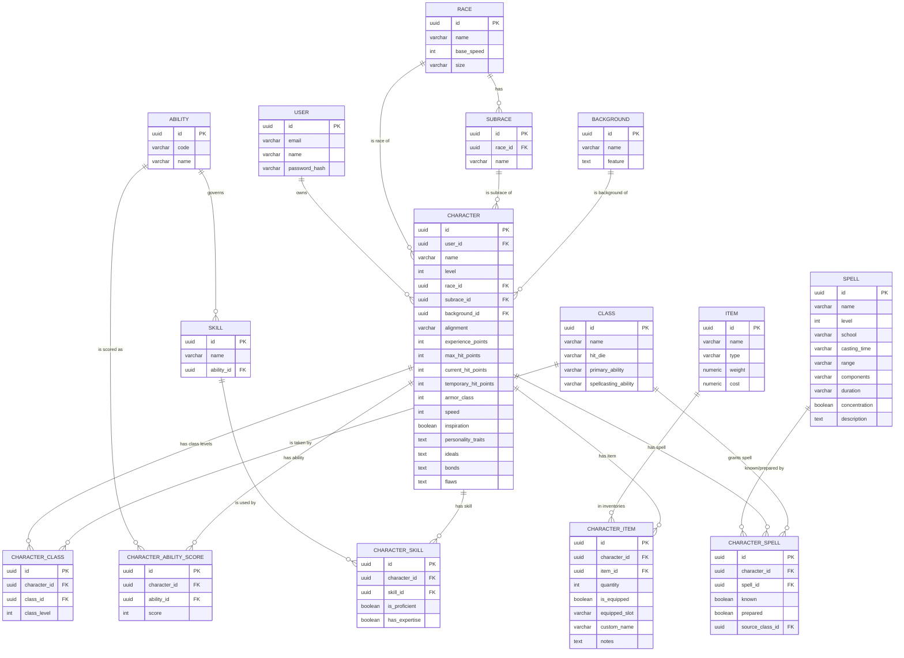

# D&D Character Builder ER Diagram

```mermaid
erDiagram
  USER {
    uuid id PK
    varchar email
    varchar name
    varchar password_hash
  }

  CHARACTER {
    uuid id PK
    uuid user_id FK
    varchar name
    int level
    uuid race_id FK
    uuid subrace_id FK
    uuid background_id FK
    varchar alignment
    int experience_points
    int max_hit_points
    int current_hit_points
    int temporary_hit_points
    int armor_class
    int speed
    boolean inspiration
    text personality_traits
    text ideals
    text bonds
    text flaws
  }

  RACE {
    uuid id PK
    varchar name
    int base_speed
    varchar size
  }

  SUBRACE {
    uuid id PK
    uuid race_id FK
    varchar name
  }

  BACKGROUND {
    uuid id PK
    varchar name
    text feature
    }

  "CLASS" {
    uuid id PK
    varchar name
    varchar hit_die
    varchar primary_ability
    varchar spellcasting_ability
  }

  CHARACTER_CLASS {
    uuid id PK
    uuid character_id FK
    uuid class_id FK
    int class_level
  }

  ABILITY {
    uuid id PK
    varchar code
    varchar name
  }

  CHARACTER_ABILITY_SCORE {
    uuid id PK
    uuid character_id FK
    uuid ability_id FK
    int score
  }

  SKILL {
    uuid id PK
    varchar name
    uuid ability_id FK
  }

  CHARACTER_SKILL {
    uuid id PK
    uuid character_id FK
    uuid skill_id FK
    boolean is_proficient
    boolean has_expertise
  }

  ITEM {
    uuid id PK
    varchar name
    varchar type
    numeric weight
    numeric cost
  }

  CHARACTER_ITEM {
    uuid id PK
    uuid character_id FK
    uuid item_id FK
    int quantity
    boolean is_equipped
    varchar equipped_slot
    varchar custom_name
    text notes
  }

  SPELL {
    uuid id PK
    varchar name
    int level
    varchar school
    varchar casting_time
    varchar range
    varchar components
    varchar duration
    boolean concentration
    text description
  }

  CHARACTER_SPELL {
    uuid id PK
    uuid character_id FK
    uuid spell_id FK
    boolean known
    boolean prepared
    uuid source_class_id FK
  }

  USER ||--o{ CHARACTER : "owns"

  RACE ||--o{ SUBRACE : "has"
  RACE ||--o{ CHARACTER : "is race of"
  SUBRACE ||--o{ CHARACTER : "is subrace of"

  BACKGROUND ||--o{ CHARACTER : "is background of"

  CHARACTER ||--o{ CHARACTER_CLASS : "has class levels"
  "CLASS" ||--o{ CHARACTER_CLASS : "is taken by"

  ABILITY ||--o{ CHARACTER_ABILITY_SCORE : "is scored as"
  CHARACTER ||--o{ CHARACTER_ABILITY_SCORE : "has ability"

  ABILITY ||--o{ SKILL : "governs"
  SKILL ||--o{ CHARACTER_SKILL : "is used by"
  CHARACTER ||--o{ CHARACTER_SKILL : "has skill"

  ITEM ||--o{ CHARACTER_ITEM : "in inventories"
  CHARACTER ||--o{ CHARACTER_ITEM : "has item"

  SPELL ||--o{ CHARACTER_SPELL : "known/prepared by"
  CHARACTER ||--o{ CHARACTER_SPELL : "has spell"
  "CLASS" ||--o{ CHARACTER_SPELL : "grants spell"
```
